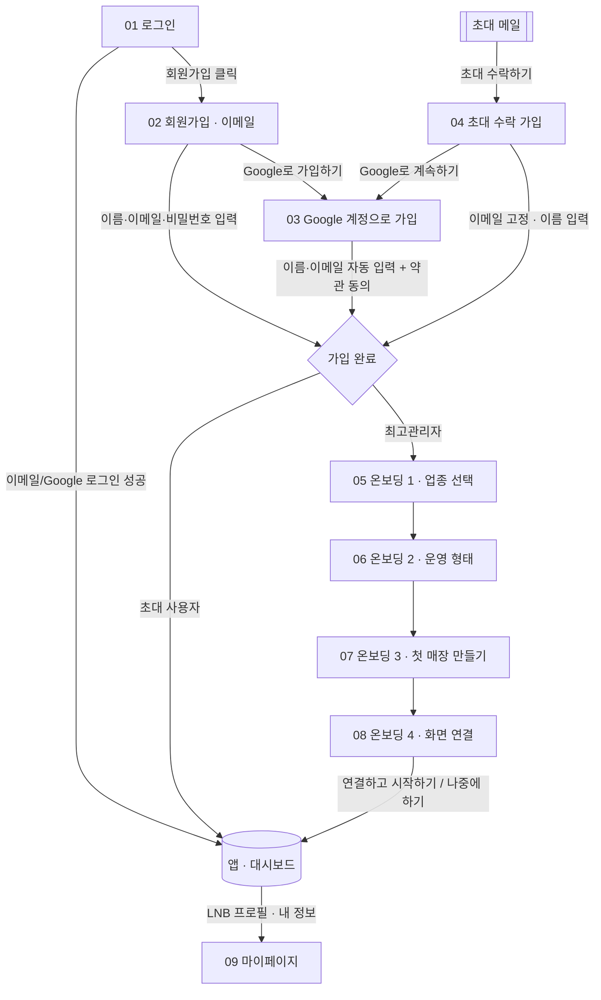

# Syncsign 화면 기획서 — 인증 · 온보딩 · 계정 관리

| 항목 | 내용 |
|---|---|
| 문서명 | 인증 / 온보딩 / 계정 관리 화면 명세서 (Screen Specification) |
| 제품 | Syncsign — 클라우드 디지털 사이니지 SaaS (웹 CMS + 셋탑박스 원격 송출) |
| 버전 | **v1.2** |
| 작성일 | 2026-08-04 |
| 대상 화면 | 로그인, 회원가입(이메일), Google 가입 확인, 초대 수락 가입, 온보딩(4단계), 마이페이지 |
| 기준 | HTML 프로토타입(`app/prototype.html`) 실제 구현 기준. 화면에서 직접 확인되지 않는 서버/정책 사항은 **[추정]** 표기 |

### v1.2 변경 요약

> **핵심 원칙 — 계정 정보는 회원가입에서, 온보딩은 서비스 초기 설정만.**
> v1.1에서 이름을 온보딩으로 이관한 결과, **온보딩을 거치지 않는 초대 사용자는 이름 없는 계정**이 되는 문제가 있었습니다(v1.1 부록 A-4로 이미 식별). v1.2는 계정 정보(이름·이메일·비밀번호)를 전부 회원가입 단계에서 확보하고, 온보딩은 워크스페이스 초기 설정만 담당하도록 **역할을 분리**합니다.

| # | 변경 | 영향 화면 |
|---|---|---|
| 1 | 회원가입에 **이름 필드 복원(필수)** — 이름 → 이메일 → 비밀번호 순 | SB-02 |
| 2 | **Google 가입 확인 화면 신설** — 이름(Display Name)·이메일 자동 입력, 별도 이름 입력 단계 없음. 종전 Google 경로에 없던 **약관 동의**를 이 화면에서 수집 | SB-03 (신설) |
| 3 | **초대 수락 가입 화면 신설** — 이메일 고정, 이름 필수, 가입 즉시 초대 역할로 워크스페이스 진입(**온보딩 미진행**) | SB-04 (신설) |
| 4 | 온보딩 **5단계 → 4단계** — "내 정보"(이름·전화번호) 단계 제거 | SB-05~08 |
| 5 | **전화번호 전면 폐지** — 회원가입·온보딩·마이페이지·프로필 수정 모두에서 제거 | SB-05, SB-09 |
| 6 | 마이페이지 **이메일 [변경] 버튼 제거** (로그인 계정 식별자, 변경 진입점 없음) | SB-09 |
| 7 | 마이페이지 **Google [연동 해제] 버튼 제거** — 연동됨 상태는 버튼 없음, 미연동 시 [연동하기]만 노출 | SB-09 |
| 8 | **구독·결제 권한 분리** — 계정 영역은 전 역할 허용, 구독 플랜·결제 수단·결제 내역·구독 해지는 **최고관리자 전용** | SB-09 |
| 9 | **셋탑 연결 코드 형식 확정** — 영문(A-Z)·숫자(0-9) 혼용 **6자리, 구분 기호(하이픈) 없음**. 입력 정규화·자릿수 검증 적용, 코드 생성기도 동일 규칙 | SB-08, 화면 관리 |

**전화번호 폐지 사유:** 현재 서비스 정책상 전화번호를 사용하는 기능(SMS 인증, 고객센터 연락 등)이 없고, 글로벌 서비스를 고려할 때 불필요한 개인정보 수집에 해당합니다. → v1.1의 부록 A-5(전화번호 국제화)도 함께 해소(Closed).

### 화면 ID 매핑 (v1.1 → v1.2)

| v1.1 | v1.2 | 비고 |
|---|---|---|
| SB-01 로그인 | SB-01 | 변경 없음 |
| SB-02 회원가입 | SB-02 | 이름 필드 복원, 초대 모드 추가 |
| — | **SB-03 Google 계정으로 가입** | 신설 |
| — | **SB-04 초대 수락 가입** | 신설 (SB-02/03의 초대 모드) |
| SB-03 온보딩 1 · 내 정보 | **삭제** | 계정 정보는 SB-02/03에서 확보 |
| SB-04 온보딩 2 · 업종 선택 | SB-05 온보딩 1 · 업종 선택 | |
| SB-05 온보딩 3 · 운영 형태 | SB-06 온보딩 2 · 운영 형태 | |
| SB-06 온보딩 4 · 첫 매장 만들기 | SB-07 온보딩 3 · 첫 매장 만들기 | |
| SB-07 온보딩 5 · 화면 연결 | SB-08 온보딩 4 · 화면 연결 | |
| SB-08 마이페이지 | SB-09 마이페이지 | 전화번호·이메일 변경·연동 해제 제거 |

---

## 0. 화면 흐름 (Screen Flow)

가입 경로는 **최고관리자(신규 워크스페이스 생성)** 와 **초대 사용자(기존 워크스페이스 합류)** 두 갈래이며, 두 경로 모두 **가입 완료 시점에 이름이 반드시 존재**합니다.

- **최고관리자(신규 가입):** 01 로그인 → 02/03 회원가입 → 05~08 온보딩 → 앱 진입
- **초대 사용자:** 초대 메일 → 04 초대 수락 가입(또는 03 Google) → **앱 바로 진입** (온보딩 없음)
- **재방문자:** 01 로그인 → 앱 진입 → (필요 시) 09 마이페이지
- **되돌아오기:** 온보딩 2~4단계는 [이전]으로 직전 단계 복귀 가능, 입력값은 세션 동안 보존. 1단계(업종 선택)는 진입점이라 [이전]이 없습니다.

### 0-1. 최종 프로세스 (요약)

| 경로 | 순서 |
|---|---|
| 이메일 회원가입 | 이름 입력 → 이메일 입력 → 비밀번호 입력 → 약관 동의 → 회원가입 → **(최고관리자만)** 서비스 초기 설정 온보딩 |
| Google 회원가입 | Google 로그인 → 이름/이메일 자동 입력 확인 → 약관 동의 → 회원가입 → **(최고관리자만)** 서비스 초기 설정 온보딩 |
| 초대 · 이메일 가입 | 초대 수락 → 이름 입력(이메일 고정) → 비밀번호 입력 → 회원가입 → **초대 역할로 앱 진입** |
| 초대 · Google 가입 | 초대 수락 → Google 계정 확인(이름·이메일 자동) → 회원가입 → **초대 역할로 앱 진입** |

---

## 공통 정책 (Common Spec)

중복 설명을 줄이기 위해 반복 컴포넌트·규칙을 여기서 정의하고, 각 화면에서는 화면별 차이·정책만 기술합니다.

### C-1. 인증 화면 공통 레이아웃 (로그인·회원가입·Google 가입·초대 수락)
- **2단 분할 레이아웃.** 좌측(약 60%)은 브랜드 마케팅 패널(다크 네이비, `#0f1b2d` 계열): 로고, 헤드라인 "매장의 모든 화면을 한 곳에서 관리하세요", 서브카피, 콘텐츠 미리보기 그리드, 신뢰 지표(운영 중인 화면 3,200+ / 연결된 매장 500+ / 송출 안정성 99.9%). 우측(약 40%)은 흰색 배경의 입력 카드(`#auth-card`).
- 좌측 패널은 모든 인증 화면에서 동일하며, 우측 카드 내용만 교체됩니다.
- **[추정]** 좌측 지표 수치는 마케팅용 정적 값. 실서비스에서는 운영 데이터 연동 또는 고정 카피로 관리.
- 모바일/태블릿 반응형 규칙은 프로토타입에 정의되어 있지 않음 → **[추정]** 별도 정의 필요.

### C-2. 온보딩 위저드 셸 (화면 05~08 공통)
- 상단 중앙에 로고, 그 아래 **프로세스 스테퍼**(`.wiz-step`, 비디오월 위저드와 동일한 표준 컴포넌트) **4단계**: `1 업종 선택` · `2 운영 형태` · `3 첫 매장 만들기` · `4 화면 연결`.
  - 스텝 상태: **현재(cur)** = 파란 원+파란 라벨, **완료(done)** = 채워진 원, **예정** = 회색 원.
- 중앙 정렬된 카드 안에 단계별 제목(h2) + 설명(sub) + 입력 영역 + 하단 액션(`ob-foot`).
- 하단 액션 정렬: 좌측 [이전], 우측 [다음]/[완료 버튼]. (1단계는 [이전] 없음, 4단계는 [나중에 하기] 스킵 추가.)
- 스테퍼는 **진행 표시 전용**이며, 미완료 단계를 클릭해 건너뛰는 기능은 없음(순차 진행). **[추정]** 완료 단계 라벨 클릭 시 해당 단계로 이동 여부는 미정.
- **접근 대상:** 최고관리자(신규 워크스페이스 생성자)만. 초대 사용자는 진입하지 않습니다.

### C-3. 계정 정보 정책 (v1.2 신설)
| 항목 | 수집 시점 | 필수 | 비고 |
|---|---|---|---|
| 이름 | **회원가입** | ✅ | 이메일 가입은 직접 입력, Google 가입은 Display Name 자동 입력. 모든 가입 경로에서 예외 없이 확보 |
| 이메일 | **회원가입** | ✅ | 로그인 계정 식별자. 초대 가입은 초대 주소로 고정, Google 가입은 계정 이메일 자동 입력 |
| 비밀번호 | **회원가입** | ✅ | 이메일 가입만 해당. Google 가입은 OAuth 대체 |
| 약관 동의 | **회원가입** | ✅ | 이메일·Google **모든 경로**에서 수집 (v1.2에서 Google 경로 누락 보완) |
| 브랜드·회사명 | 온보딩 3단계 / 마이페이지 | — | 첫 매장명이 기본값, 마이페이지에서 변경 |
| 전화번호 | **수집하지 않음** | — | v1.2에서 전면 폐지 |

- **불변식:** 어떤 가입 경로로 들어와도 계정 생성이 완료된 시점에 `name`은 항상 비어 있지 않습니다. 온보딩 진행 여부와 무관합니다.

### C-4. 공통 컴포넌트
| 컴포넌트 | 사양 |
|---|---|
| 기본 버튼 | Primary(파란 채움), Google(흰 배경+G 아이콘), Ghost/기본(테두리), Danger-tonal(해지). `disabled` 시 반투명·클릭 불가 |
| 입력 필드(`.input`) | 라벨 + 인풋. 필수 항목은 라벨 옆 빨간 `*`. 검증 실패 시 `.error` 클래스(빨간 테두리) 적용 |
| 읽기 전용 필드 | `disabled` + 배경 `--sunken`(`#F8F9FB`). 자동 입력·고정 값 표기에 사용(Google 이름/이메일, 초대 이메일) |
| 필드 헬퍼 텍스트 | 인풋 하단 12px 회색 보조 문구(`.pw-hint` 재사용). 비밀번호 강도 힌트·자동 입력 출처 안내에 사용 |
| 토스트(`toast`) | 우측 상단 알림. 일반/오류(`{err:true}`) 2종. 사용자 행동 결과·검증 실패 피드백에 사용 |
| 드롭다운(select) | 국가·지역 선택 등. 기본값 선표시 |
| 체크박스 | 약관 동의 등 on/off 토글 |

### C-5. 공통 상태값 규칙
- **Disabled:** 필수 선택/입력 미완료 시 진행 버튼 비활성 (예: 온보딩 업종·운영 형태 미선택 시 [다음]).
- **Error(검증):** 필수값 누락·형식 오류 시 해당 인풋에 `.error` + 토스트 안내. 복수 오류 시 **첫 번째 오류 필드로 포커스 이동**.
- **Loading:** 프로토타입에는 명시적 로딩 상태 없음 → **[추정]** 실서비스에서 로그인/가입/매장 생성/코드 검증 등 서버 통신 구간에 버튼 스피너·중복 제출 방지 필요.
- **Empty:** 인증·온보딩 입력 화면에는 해당 없음. 앱 진입 후 대시보드에서 별도 Empty State(온보딩 준비 목록)로 처리(본 문서 범위 외).

### C-6. 역할(Role) 정의
| 값 | 라벨 | 비고 |
|---|---|---|
| `owner` | 최고관리자 | 워크스페이스 생성자. 온보딩 진행 주체. 초대로 부여 불가 |
| `admin` | 관리자 | 콘텐츠·화면·매장·사용자 편집 가능 |
| `viewer` | 뷰어 | 조회 전용 |

- 초대 시 선택 가능한 역할은 **관리자 / 뷰어** 2종입니다.
- **[확인 필요]** 정책 요청서에는 "편집자(Editor)"가 언급되었으나 현재 제품 권한 체계에는 존재하지 않습니다. 별도 역할로 신설할지, `admin`으로 통합할지 결정 필요 → 부록 A-4.

**페이지 단위 권한(`ROLE_PERMS`)의 한계와 예외:** 권한은 기능 페이지 단위(콘텐츠·화면·매장·사용자 등)로 `없음/보기/편집` 3단계로 정의됩니다. 다만 **'내 정보'(SB-09)** 는 한 페이지 안에 성격이 다른 두 영역이 섞여 있어 페이지 단위로 표현할 수 없습니다.

| 영역 | 접근 범위 | 근거 |
|---|---|---|
| 계정 (프로필·비밀번호·Google 연동) | **전 역할** 조회·편집 | 본인 계정 정보이므로 역할과 무관 |
| 구독·결제 (플랜·결제 수단·결제 내역·구독 해지) | **최고관리자 전용** | 워크스페이스 소유자의 계약·과금 정보 |

→ 이 예외는 `ROLE_PERMS`가 아니라 세션 실효 역할 판별(`isOwnerSession()`)로 처리합니다. **초대 팀원 세션과 최고관리자의 '권한 미리보기' 모두** 동일하게 적용되어, 미리보기로도 비-최고관리자에게 무엇이 보이는지 검수할 수 있습니다.

### C-7. 셋탑 연결 코드 규격 (v1.2 확정)

셋탑박스가 TV 화면에 표시하는 등록 코드입니다. **온보딩 화면 연결(SB-08) · 화면 추가 · 셋탑 연결/재연결** 세 화면이 같은 규칙을 공유합니다.

| 항목 | 규격 |
|---|---|
| 문자 집합 | 영문 대문자 `A-Z` + 숫자 `0-9` (혼용) |
| 길이 | **6자리 고정** |
| 구분 기호 | **없음** (하이픈 사용하지 않음) |
| 정규식 | `^[A-Z0-9]{6}$` |
| 표기 예 | `3F82KQ`, `AB12CD` |
| 생성 | 서버 자동 생성. 모든 코드에 영문·숫자가 최소 1자씩 포함됨 |

**입력 UX (3개 화면 공통)**
- 실시간 정규화: 소문자 → 대문자 자동 변환, 영숫자 외 문자(하이픈·공백·기호) 자동 제거, 6자 초과 입력 절단(`maxlength=6`).
  - 사용자가 `3f8-2kq`를 붙여넣어도 `3F82KQ`로 정리되므로, 하이픈이 포함된 구버전 코드 표기에 익숙한 사용자도 실패하지 않습니다.
- `autocapitalize=characters`, `autocomplete=off`, `spellcheck=false` 적용.
- 자릿수 검증: **6자를 모두 채워야** 제출됩니다. 부분 입력 시 인풋 `.error` + 오류 토스트 "연결 코드 6자리를 모두 입력해주세요".
- 코드가 필수인 화면(화면 추가의 [지금 연결하기], 셋탑 연결/재연결)에서는 공란도 오류입니다. 온보딩(SB-08)만 공란을 "나중에 하기"로 허용합니다.

**[추정] 남은 정책 결정** — 코드 만료 시간, 재발급 시 기존 코드 즉시 만료 여부(현재 UI 문구상 즉시 만료), 혼동 문자(`0`/`O`, `1`/`I`) 제외 여부. TV 화면에서 읽어 옮겨 적는 코드이므로 혼동 문자 제외를 권장하나, 현재는 전체 36자를 사용합니다 → 부록 A-15.

---

## SB-01. 로그인

**1) 화면명**
로그인 (Login) / `#login` (기본 진입 화면)

**2) 화면 목적**
기존 가입자가 이메일+비밀번호 또는 Google 계정으로 워크스페이스에 재진입한다. 미가입자를 회원가입으로 유도하는 공통 진입점 역할도 겸한다.

**3) 사용자 시나리오**
- 재방문 운영자가 서비스 URL 접속 → 이메일·비밀번호 입력 → [로그인] → 대시보드 진입.
- 계정이 없는 사용자가 "회원가입" 링크로 이동.
- 비밀번호를 잊은 사용자가 "비밀번호 찾기"로 재설정 요청.

**4) 주요 기능**
- 이메일/비밀번호 로그인
- Google 소셜 로그인("Google로 계속하기")
- 회원가입 화면 이동
- 비밀번호 찾기(재설정) 진입
- 로그인 실패 오류 안내

**5) UI 구성 요소**
- (좌) C-1 브랜드 마케팅 패널
- (우) 입력 카드
  - 제목 "다시 만나서 반가워요"
  - 안내 "계정이 없으신가요? **회원가입**"(링크)
  - [Google로 계속하기] 버튼
  - 구분선 "또는 이메일로"
  - 이메일 인풋(placeholder `you@company.com`)
  - 비밀번호 인풋(placeholder `••••••••`) + 라벨 우측 "비밀번호 찾기" 링크
  - [로그인] 버튼(전체 폭)
  - 프로토타입 안내 문구(실서비스 제거 대상)

**6) 기능 상세 명세**
| 트리거 | 처리/결과 |
|---|---|
| [로그인] 클릭, 이메일 또는 비밀번호 미입력 | 오류 토스트 "이메일과 비밀번호를 입력해주세요" 노출, 진행 중단 |
| [로그인] 클릭, 정상 입력 | 대시보드로 진입, 토스트 "로그인했어요" |
| 비밀번호 입력 후 Enter 키 | [로그인] 클릭과 동일 동작 |
| 로그인 실패(자격 증명 오류) | **오류 상태** 렌더 → 이메일·비밀번호 인풋 `.error` + 인라인 오류 "이메일 또는 비밀번호가 일치하지 않아요." |
| [Google로 계속하기] 클릭 | Google 인증 후 대시보드 진입, 토스트 "Google 계정으로 로그인했어요" |
| "회원가입" 링크 클릭 | SB-02 회원가입으로 전환 |
| "비밀번호 찾기" 클릭 | 비밀번호 재설정 플로우 진입(재설정 메일 발송 → 메일 미리보기 → 새 비밀번호 설정) |

- **[프로토타입 한정]** 아무 이메일로나 로그인되며, 비밀번호에 `error` 입력 시 오류 상태를 확인 가능. → 실서비스에서 제거.

**7) 입력/출력 데이터**
- 입력: `email`(string), `password`(string), 또는 Google OAuth 토큰.
- 출력: 인증 세션(세션 사용자 `name`, `brand`, `role`, `userType`, `country` 등), 대시보드 리다이렉트.
- **[추정]** 로그인 성공 시 사용자 프로필·워크스페이스·권한(role) 정보를 함께 로드.

**8) 상태값 및 예외 처리**
- **Error:** 자격 증명 불일치 → 인풋 error + 인라인 오류 문구.
- **계정 잠금:** **[추정]** 임계 횟수·잠금 시간·해제 조건 미정 → 정책 확정 필요.
- **Disabled/Loading:** 프로토타입 미정 → **[추정]** 제출 중 버튼 비활성·중복요청 차단 필요.
- 입력 누락: 토스트 안내(위 6번).

**9) 화면 이동(Flow)**
- 진입: 서비스 URL 기본 화면.
- 나감: [로그인]/[Google] 성공 → 앱(대시보드) · "회원가입" → SB-02 · "비밀번호 찾기" → 재설정 플로우.

**10) 개발 시 참고사항 및 정책**
- 계정 잠금 정책(임계 횟수, 잠금 시간, 알림 방식) 백엔드 확정 필요.
- 프로토타입 전용 안내 문구·바이패스 로직 제거.
- Google OAuth 스코프·신규 계정 자동생성 여부 확정 필요 **[추정]** (로그인 화면의 Google은 "가입"이 아닌 "로그인" 성격).
- **비활성 사용자 로그인 차단:** 사용자 관리에서 '비활성' 처리된 계정은 로그인 불가 정책이 문구상 존재 → 로그인 시 차단 및 안내 문구 정의 필요 **[추정]**.

---

## SB-02. 회원가입 (이메일)

**1) 화면명**
회원가입 (Sign Up) / `#signup`

**2) 화면 목적**
신규 사용자가 **계정 정보(이름·이메일·비밀번호)를 한 번에 입력**해 계정을 생성하고 14일 무료 체험을 시작한다.
**v1.2 변경:** 이름을 이 단계에서 필수로 받는다. 온보딩을 거치지 않는 초대 사용자까지 포함해 **모든 가입 경로에서 이름이 누락되지 않도록** 계정 정보 수집 지점을 회원가입으로 일원화한다.

**3) 사용자 시나리오**
- 처음 방문한 운영자가 "무료로 시작" 의도로 진입 → 이름·이메일·비밀번호 입력, 약관 동의 → [무료로 시작하기] → 온보딩 진입.
- 또는 [Google로 가입하기] → SB-03 Google 가입 확인 화면.

**4) 주요 기능**
- 이름/이메일/비밀번호 회원가입
- Google 소셜 가입 진입
- 비밀번호 강도 실시간 힌트
- 약관/개인정보 동의
- 로그인 화면 이동

**5) UI 구성 요소**
- (좌) C-1 브랜드 마케팅 패널
- (우) 입력 카드
  - 제목 "14일 무료로 시작하세요"
  - 안내 "이미 계정이 있으신가요? **로그인**"(링크)
  - [Google로 가입하기] 버튼
  - 구분선 "또는 이메일로"
  - **이름 인풋\*** (placeholder `예) 김민규`, `autocomplete=name`) — **v1.2 복원**
  - 이메일 인풋\* (placeholder `you@company.com`)
  - 비밀번호 인풋\* (placeholder `8자 이상`) + 강도 힌트 2종
  - 약관 동의 체크박스: "**이용약관**과 **개인정보 처리방침**에 동의합니다"
  - [무료로 시작하기] 버튼(전체 폭)
- **필드 순서 고정:** 이름 → 이메일 → 비밀번호 (계정 주체 → 식별자 → 자격증명 순)
- **전화번호 필드 없음** (v1.2에서 전면 폐지)
- 진입 시 **이름 인풋에 자동 포커스**.

**6) 기능 상세 명세**
| 트리거 | 처리/결과 |
|---|---|
| 비밀번호 입력(실시간) | 강도 힌트 갱신: "○/✓ 8자 이상", "○/✓ 영문+숫자 조합". 충족 시 ✓·강조 |
| 이름 입력 중 | 기존 `.error` 표시 해제 |
| [무료로 시작하기] 클릭, **이름 공란** | 이름 인풋 `.error`, 오류 토스트 "필수 항목을 확인해주세요", 이름 필드로 포커스 |
| 〃, 이메일 형식 오류 | 이메일 인풋 `.error`, 동일 토스트 |
| 〃, 비밀번호 8자 미만 | 비밀번호 인풋 `.error`, 동일 토스트 |
| 〃, 복수 항목 오류 | 오류 항목 전체에 `.error` 동시 표시 + **첫 오류 필드로 포커스** |
| 〃, 약관 미동의 | 오류 토스트 "약관에 동의해주세요" |
| 〃, 모든 조건 충족 | 계정 생성 → 온보딩 진입(SB-05), 환영 토스트 "가입을 환영해요! 초기 설정만 마치면 바로 시작할 수 있어요" |
| [Google로 가입하기] 클릭 | SB-03 Google 가입 확인 화면으로 전환 |
| "로그인" 링크 클릭 | SB-01 로그인으로 전환 |
| "이용약관"/"개인정보 처리방침" 클릭 | 약관 문서 노출 **[추정: 링크 목적지 미정, 팝업/새 탭 별도 정의]** |

- **이름 검증 규칙:** 공백 제거 후 1자 이상. **[추정]** 최대 길이·허용 문자(이모지/특수문자) 정책 확정 필요.
- **이메일 검증 규칙:** `표준 이메일 형식`(로컬@도메인.TLD) 정규식 통과 필요.
- **비밀번호 규칙:** 최소 8자. 힌트로 "영문+숫자 조합"을 권장 표기(현재 8자 이상만 필수 검증, 조합은 안내 수준). **[추정]** 조합 강제 여부는 정책 확정 필요.
- **가입 완료 시 반영값:** 세션 `name`, 계정 프로필 `name`·`email`, `google=false`(이메일 가입), 세션 플래그 `first=true`(신규), 브랜드명은 공란으로 시작해 온보딩 3단계(첫 매장)에서 채워짐.

**7) 입력/출력 데이터**
- 입력: `name`(string, 필수), `email`(string, 필수·형식검증), `password`(string, 8자+), `termsAgreed`(boolean, 필수).
- 출력: 신규 계정(`name` 확정), 인증 세션, 온보딩 진입 상태.
- 전화번호는 수집하지 않음.
- **[추정]** 이메일 중복 검사·인증 메일 발송은 서버 처리 필요(프로토타입 미구현).

**8) 상태값 및 예외 처리**
- **Error:** 이름 공란·이메일 형식·비밀번호 길이·약관 미동의 각각 위 규칙대로 처리.
- **[추정] 이메일 중복:** 이미 가입된 이메일 → "이미 가입된 이메일이에요. 로그인해 주세요" 유형 안내 + 로그인 유도 필요(미구현).
- **Loading:** 제출 중 버튼 비활성/스피너 **[추정]**.

**9) 화면 이동(Flow)**
- 진입: SB-01 "회원가입" 링크, 딥링크 `#signup`.
- 나감: 가입 성공 → SB-05 온보딩 1단계 · [Google로 가입하기] → SB-03 · "로그인" → SB-01.

**10) 개발 시 참고사항 및 정책**
- **v1.1 부록 A-4(이름 없는 계정) 해소:** 이름이 가입 트랜잭션에 포함되므로, 온보딩 이탈과 무관하게 이름 없는 계정이 생기지 않습니다. 다만 **온보딩 미완료(매장 0개) 계정의 재로그인 처리**는 여전히 정책이 필요합니다 → 부록 A-2.
- 14일 무료 체험의 시작 시점(가입일 기준)·종료 처리·결제 전환 로직은 별도 명세.
- 이메일 인증(가입 직후 verify) 흐름 정의 필요.
- 이름은 앱 좌측 하단 프로필(`{이름}님`), **아바타 이니셜(이름 첫 글자)**, 온보딩 1단계 인사말, 마이페이지 계정 카드에 즉시 반영됩니다.

---

## SB-03. Google 계정으로 가입 (신설)

**1) 화면명**
Google 계정으로 가입 (Google Sign Up · Confirm) / `#google-signup`

**2) 화면 목적**
Google 계정에서 **이름(Display Name)과 이메일을 자동으로 가져와** 계정을 생성한다. 사용자가 이름을 다시 입력할 필요가 없으며, 자동 입력된 값을 **확인**하고 **약관에 동의**하는 것만으로 가입이 완료된다.

> **v1.2 신설 배경 (2가지)**
> 1. **정책 가시화** — "Google 가입 시 이름·이메일 자동 입력"이 실제로 일어났음을 사용자와 검수자가 화면에서 확인할 수 있어야 합니다.
> 2. **약관 동의 누락 보완** — v1.1까지 Google 가입 경로는 약관 동의 없이 바로 온보딩으로 진입했습니다. 법적 동의 수집 지점이 없던 문제를 이 화면에서 해결합니다.

**3) 사용자 시나리오**
- SB-02(또는 SB-04)에서 [Google로 가입하기 / 계속하기] 클릭 → Google 인증 → 돌아온 계정의 이름·이메일이 채워진 확인 화면 → 약관 동의 → [가입 완료].

**4) 주요 기능**
- Google 계정 이름·이메일 자동 입력(읽기 전용) 표시
- 약관/개인정보 동의
- 가입 완료
- 다른 방법으로 가입하기(이메일 가입으로 복귀)

**5) UI 구성 요소**
- (좌) C-1 브랜드 마케팅 패널
- (우) 입력 카드
  - 제목 "Google 계정으로 가입"
  - 설명 "Google 계정에서 이름과 이메일을 불러왔어요. 확인 후 가입을 완료해 주세요."
  - **이름 필드(읽기 전용)** — 값: Google Display Name · 헬퍼 "Google 계정 이름(Display Name)에서 자동으로 가져왔어요"
  - **이메일 필드(읽기 전용)** — 값: Google 계정 이메일 · (초대 경유 시) 헬퍼 "초대받은 주소와 일치해요"
  - 약관 동의 체크박스
  - [가입 완료] 버튼(전체 폭)
  - 하단 링크 "다른 방법으로 가입하기"
- **입력 가능한 필드가 하나도 없습니다** — 별도의 이름 입력 단계가 없음을 화면 구조로 보장.

**6) 기능 상세 명세**
| 트리거 | 처리/결과 |
|---|---|
| SB-02/SB-04에서 Google 버튼 클릭 | Google OAuth 인증 → 반환된 `displayName`·`email`로 본 화면 렌더 |
| [가입 완료] 클릭, 약관 미동의 | 오류 토스트 "약관에 동의해주세요", 진행 중단 |
| [가입 완료] 클릭, 동의 완료 (**일반**) | 계정 생성 → 온보딩 진입(SB-05), 토스트 "Google 계정으로 가입했어요! 서비스 초기 설정을 시작할게요" |
| [가입 완료] 클릭, 동의 완료 (**초대 경유**) | 계정 생성 → **온보딩 없이 앱 진입**, 토스트 "{이름}님, 환영해요! {역할} 권한으로 팀에 합류했어요" |
| "다른 방법으로 가입하기" 클릭 | SB-02(초대 경유 시 SB-04)로 복귀. 초대 컨텍스트 유지 |

- **초대 경유 시 이메일 고정:** 초대는 특정 이메일 주소에 귀속되므로, 표시되는 이메일은 **초대 주소**입니다.
- **가입 완료 시 반영값:** 계정 프로필 `name`(=Display Name), `email`, `google=true`.

**7) 입력/출력 데이터**
- 입력: Google OAuth 결과 `displayName`(string), `email`(string), `termsAgreed`(boolean, 필수).
- 출력: 신규 계정(`name` 확정), 인증 세션, Google 연동 상태 `true`.

**8) 상태값 및 예외 처리**
- **약관 미동의:** 유일한 차단 조건.
- **[추정] Display Name 공백/누락:** Google 계정에 표시 이름이 없는 예외 케이스 → 이름 입력을 요구하는 폴백 화면 필요. 부록 A-1.
- **[추정] 초대 주소 불일치:** 사용자가 초대받은 주소와 다른 Google 계정으로 인증한 경우 → 차단 + "초대받은 {이메일}로 로그인해 주세요" 안내 필요(프로토타입 미구현). 부록 A-3.
- **[추정] 이미 가입된 Google 계정:** 가입이 아닌 로그인으로 전환 안내 필요.
- **[프로토타입 한정]** 실제 OAuth 대신 고정 계정(`김민규` / `mk.kim@gmail.com`)으로 돌아온 것으로 가정합니다.

**9) 화면 이동(Flow)**
- 진입: SB-02 또는 SB-04의 Google 버튼, 딥링크 `#google-signup`.
- 나감: [가입 완료] → SB-05 온보딩(일반) 또는 앱(초대) · "다른 방법으로 가입하기" → SB-02/SB-04.

**10) 개발 시 참고사항 및 정책**
- Google 프로필 이미지 활용 여부 결정 필요(현재는 이니셜 아바타 사용).
- Display Name은 Google에서 변경될 수 있음 → **가입 시점 값을 스냅샷으로 저장**하고 이후 마이페이지에서 사용자가 직접 수정하는 방식(현재 구현). 재로그인 시 동기화하지 않습니다.
- OAuth 스코프는 `profile`, `email` 최소 범위 권장.

---

## SB-04. 초대 수락 가입 (신설)

**1) 화면명**
초대 수락 가입 (Invited Sign Up) / `#invite-signup`

**2) 화면 목적**
관리자가 초대한 사용자가 **초대 메일의 링크를 통해** 계정을 만들고, **초대에 명시된 역할·담당 매장으로 즉시 워크스페이스에 합류**한다.
**v1.2 변경:** 초대 사용자도 최고관리자와 **동일한 계정 정책**(이름·이메일·비밀번호)을 적용받되, **온보딩(서비스 초기 설정)은 진행하지 않는다.** 워크스페이스 초기 설정은 이미 최고관리자가 완료한 상태이기 때문이다.

**3) 사용자 시나리오**
- 초대 메일 수신 → [초대 수락하기] → 본 화면(이메일 고정) → 이름·비밀번호 입력, 약관 동의 → [가입하고 시작하기] → 초대 역할로 대시보드 진입.
- 또는 [Google로 계속하기] → SB-03 → 동일하게 앱 진입.

**4) 주요 기능**
- 초대 컨텍스트(이메일·역할·담당 매장) 표시
- 이름/비밀번호 입력 (이메일은 고정)
- Google 계정으로 계속하기
- 약관/개인정보 동의
- 가입 완료 및 역할 적용 앱 진입

**5) UI 구성 요소**
SB-02와 **동일 컴포넌트의 초대 모드**입니다. 차이는 다음과 같습니다.

| 요소 | 일반 가입(SB-02) | 초대 수락 가입(SB-04) |
|---|---|---|
| 제목 | "14일 무료로 시작하세요" | "**{브랜드} 팀에 합류하세요**" |
| 서브 문구 | "이미 계정이 있으신가요? 로그인" | "**{이메일}** 주소로 **{역할}** 권한 초대를 받았어요." |
| Google 버튼 | "Google로 가입하기" | "Google로 **계속하기**" |
| 이름 | 입력 필수 | 입력 필수 (동일) |
| 이메일 | 직접 입력 | **초대 주소로 고정(읽기 전용)** |
| 비밀번호 | 입력 필수 | 입력 필수 (동일) |
| 제출 버튼 | "무료로 시작하기" | "**가입하고 시작하기**" |
| 하단 안내 | 없음 | "초대받은 이메일로만 가입할 수 있어요. 다른 주소로 참여하려면 관리자에게 재초대를 요청해 주세요." |
| 가입 후 이동 | 온보딩(SB-05) | **앱 대시보드(온보딩 없음)** |

**6) 기능 상세 명세**
| 트리거 | 처리/결과 |
|---|---|
| 초대 메일 [초대 수락하기] (유효) | 본 화면 진입. 초대 컨텍스트(`email`/`role`/`scope`)가 화면에 전달됨 |
| 초대 메일 [초대 수락하기] (만료) | **초대 만료 안내 화면**으로 전환 — "초대 링크가 만료되었습니다. 관리자에게 다시 초대를 요청해주세요." + [로그인으로 돌아가기] |
| 검증 규칙 | SB-02와 동일(이름 공란·비밀번호 8자·약관 동의). 이메일은 고정값이라 사용자 오류 발생 없음 |
| [가입하고 시작하기] 클릭, 조건 충족 | 계정 생성 → **초대 역할 적용** → 앱 대시보드 진입, 토스트 "{이름}님, 환영해요! {역할} 권한으로 팀에 합류했어요" |
| [Google로 계속하기] 클릭 | SB-03(초대 모드) — 이메일은 초대 주소로 표시 |

- **가입 완료 시 서버 처리:**
  1. 계정 생성(`name`·`email`·`password` 또는 Google 연동)
  2. 초대 레코드의 사용자 상태를 `초대 대기` → **`활성`** 으로 전환하고, **플레이스홀더 이름을 실제 입력 이름으로 교체**
  3. 초대에 명시된 `role`·`scope` 부여
  4. 세션에 워크스페이스 브랜드 연결 후 대시보드 진입
- **초대 대기 사용자의 이름:** 관리자가 초대할 때 사용자 관리 목록에는 이메일 로컬파트가 임시 표시명으로 들어갑니다. **실제 이름은 초대 수락 가입 시점에 확정**됩니다.

**7) 입력/출력 데이터**
- 입력: `name`(필수), `password`(8자+) 또는 Google OAuth, `termsAgreed`(필수). 초대 토큰에서 `email`·`role`·`scope` 수신.
- 출력: 활성 사용자 계정(`name` 확정, 역할·담당 매장 부여), 인증 세션, 대시보드 진입.

**8) 상태값 및 예외 처리**
- **초대 만료:** 만료 링크 클릭 시 전용 안내 화면. 유효 기간은 메일 문구상 **7일**.
  - 프로토타입에서는 만료 화면의 "유효한 링크로 열기"로 정상 수락 화면을 확인할 수 있으며, **초대 컨텍스트(이메일·역할·담당 매장)가 유지**됩니다.
- **[추정] 이미 가입된 이메일로 초대받은 경우:** 신규 가입이 아니라 기존 계정에 워크스페이스를 추가하는 흐름이 필요 → 부록 A-3.
- **[추정] 초대 취소/역할 변경 후 수락:** 수락 시점의 최신 초대 상태를 서버에서 재검증해야 함.
- **Loading:** 제출 중 버튼 비활성 **[추정]**.

**9) 화면 이동(Flow)**
- 진입: 초대 메일 [초대 수락하기], 딥링크 `#invite-signup`.
- 나감: 가입 완료 → 앱 대시보드 · [Google로 계속하기] → SB-03 · (만료) → 초대 만료 안내.

**10) 개발 시 참고사항 및 정책**
- **온보딩 미진행이 정상 동작입니다.** 초대 사용자는 업종·운영 형태·첫 매장·화면 연결을 다시 설정하지 않습니다(워크스페이스 단위 설정이므로).
- 가입 직후 앱 셸의 표기:
  - 좌측 하단 권한 표기 = **역할명 그대로**(예: `권한: 뷰어`). 최고관리자의 '권한 미리보기' 기능과 달리 **"(미리보기)" 표기와 [미리보기 종료] 버튼이 없습니다.**
  - 상단 배너 = "**{역할}** 권한으로 팀에 참여 중이에요 · 담당 범위 **{담당 매장}**"
  - 권한 밖 메뉴는 LNB에서 숨김, 편집 권한 없는 페이지는 읽기 전용 잠금.
- 초대 토큰은 일회용·만료 검증 필수. 토큰에 역할이 담기므로 **서버에서 재검증** 없이 클라이언트 값을 신뢰하지 않을 것.

---

## SB-05. 온보딩 1단계 — 업종 선택

**1) 화면명**
온보딩 · 업종 선택 (Onboarding Step 1 · Industry) / `#onboarding`

**2) 화면 목적**
운영 업종을 선택받아 **업종 맞춤 템플릿·위젯을 추천**하기 위한 기준값을 확보한다.
**v1.2 변경:** 기존 1단계였던 "내 정보"(이름·전화번호)가 제거되어 **본 화면이 온보딩의 진입점**이 되었다.

**3) 사용자 시나리오**
가입을 마친 최고관리자가 온보딩 첫 화면에서 자신의 매장 업종 카드를 하나 선택하고 다음으로 진행한다.

**4) 주요 기능**
- 업종 단일 선택(6종)
- 다음 진행

**5) UI 구성 요소**
- C-2 위저드 셸(스테퍼 1단계 활성)
- 제목 "**{이름}님, 어떤 매장을 운영하시나요?**" — 회원가입에서 받은 이름으로 개인화. 이름이 없는 예외 상황에서는 "어떤 매장을 운영하시나요?"로 표기
- 설명 "업종에 맞는 템플릿과 위젯을 추천해 드려요. 나중에 바꿀 수 있어요."
- 업종 카드 6종(2×3 그리드, 이모지+라벨): **카페 · 음식점 · 뷰티 · 리테일 · 병원·약국 · 기타**
- [다음] (선택 전 비활성) — **[이전] 버튼 없음**(진입점)

**6) 기능 상세 명세**
| 트리거 | 처리/결과 |
|---|---|
| 업종 카드 클릭 | 해당 카드 선택 상태(`on`)로 표시, 단일 선택(기존 선택 해제), [다음] 활성화 |
| [다음] 클릭(선택됨) | 선택 업종 보관, 2단계로 진행 |

**7) 입력/출력 데이터**
- 입력: `industry`(enum: 카페/음식점/뷰티/리테일/병원·약국/기타).
- 출력: 업종 기준값(템플릿·위젯 추천에 사용). **[추정]** 추천 매핑 로직은 별도 정의.

**8) 상태값 및 예외 처리**
- **Disabled:** 미선택 시 [다음] 비활성.
- 재진입 시 이전 선택 유지(세션 보존).

**9) 화면 이동(Flow)**
- 진입: SB-02/SB-03 가입 성공(최고관리자), 딥링크 `#onboarding`, 또는 SB-06 [이전].
- 나감: [다음] → SB-06(운영 형태).

**10) 개발 시 참고사항 및 정책**
- "나중에 바꿀 수 있어요" — 업종은 가입 후 설정에서 변경 가능해야 함(변경 경로 별도 명세).
- 업종별 추천 템플릿/위젯 세트 정의 필요 **[추정]**.
- 인사말에 쓰이는 이름은 가입 단계에서 확보된 값이므로 **항상 존재**합니다(C-3 불변식).

---

## SB-06. 온보딩 2단계 — 운영 형태

**1) 화면명**
온보딩 · 운영 형태 (Onboarding Step 2 · Operation Type)

**2) 화면 목적**
단일/다중 매장 운영 여부를 선택받아 **대시보드와 관리 도구를 운영 규모에 맞게 차별화**한다. 이 값(`userType`)은 서비스 경험 분기의 핵심 기준이다.

**3) 사용자 시나리오**
개인·소상공인은 "단일 매장 운영자", 프랜차이즈·기업 담당자는 "다중 매장 운영자"를 선택한다.

**4) 주요 기능**
- 운영 형태 단일 선택(2종)
- 이전/다음 진행

**5) UI 구성 요소**
- C-2 위저드 셸(스테퍼 2단계 활성)
- 제목 "어떤 형태로 운영하시나요?"
- 설명 "운영 형태에 맞춰 대시보드와 관리 도구를 준비해 드려요. 나중에 설정에서 바꿀 수 있어요."
- 선택 카드 2종(좌우 배치, 이모지+제목+설명+배지):
  - **단일 매장 운영자** 🏪 — "내 매장 1~2곳을 직접 관리해요" · 배지 `개인 · 소상공인`
  - **다중 매장 운영자** 🏢 — "여러 지점을 본사에서 한 번에 관리해요" · 배지 `프랜차이즈 · 기업`
- [이전] / [다음] (선택 전 [다음] 비활성)

**6) 기능 상세 명세**
| 트리거 | 처리/결과 |
|---|---|
| 카드 클릭 | 단일 선택 상태 표시, [다음] 활성화 |
| [다음] 클릭(선택됨) | 세션 `userType`에 `single` 또는 `multi` 저장, 3단계로 진행 |
| [이전] 클릭 | 1단계(업종 선택)로 복귀 |

**7) 입력/출력 데이터**
- 입력: `userType`(enum: `single` | `multi`).
- 출력: 대시보드/기능 노출 분기 기준값.

**8) 상태값 및 예외 처리**
- **Disabled:** 미선택 시 [다음] 비활성.
- 재진입 시 선택 유지.

**9) 화면 이동(Flow)**
- 진입: SB-05 [다음] 또는 SB-07 [이전].
- 나감: [다음] → SB-07(첫 매장) · [이전] → SB-05.

**10) 개발 시 참고사항 및 정책**
- `userType`에 따른 대시보드·메뉴·기능 차이 명세 필요(예: 다중 매장은 매장 전환/본사 관점 집계 등) **[추정]**.
- "설정에서 바꿀 수 있어요" — 변경 시 대시보드 구성이 바뀌므로 전환 정책·데이터 영향 검토 필요.

---

## SB-07. 온보딩 3단계 — 첫 매장 만들기

**1) 화면명**
온보딩 · 첫 매장 만들기 (Onboarding Step 3 · Create First Store)

**2) 화면 목적**
콘텐츠·화면 관리의 기본 단위인 **매장(Store)** 을 최초 1개 생성한다.

**3) 사용자 시나리오**
사용자가 매장 이름과 위치(국가/지역/상세주소)를 입력하고 [매장 만들기]로 첫 매장을 생성한다.

**4) 주요 기능**
- 매장 이름 입력(필수)
- 국가 선택(필수) / 지역(시·도) 선택 / 상세 주소 입력
- 매장 생성

**5) UI 구성 요소**
- C-2 위저드 셸(스테퍼 3단계 활성)
- 제목 "첫 매장을 만들어 주세요"
- 설명 "매장은 화면과 콘텐츠를 관리하는 기본 단위예요. 해외 매장도 등록할 수 있고, 매장이 여러 곳이라면 나중에 얼마든지 추가할 수 있어요."
- 매장 이름 인풋\* (placeholder `예) 싱크사인 본점`)
- 국가 드롭다운\* (기본값 `대한민국`)
- 지역(시/도) 드롭다운 (기본값 `서울`)
- 상세 주소 인풋 (placeholder `예) 강남대로 396, 2층`)
- [이전] / [매장 만들기]

**6) 기능 상세 명세**
| 트리거 | 처리/결과 |
|---|---|
| 국가 변경 | 선택 국가에 맞춰 지역(시/도) 옵션 세트 갱신(위치 필드 연동) |
| [매장 만들기] 클릭, 매장 이름 공란 | 매장 이름 인풋 `.error`, 진행 중단 |
| [매장 만들기] 클릭, 정상 | 매장 생성(이름/지역/상세주소/기본 화면 0대), 세션 브랜드명 미설정 시 매장명으로 설정, 세션 국가 반영 → 4단계로 진행 |
| [이전] 클릭 | 2단계(운영 형태)로 복귀 |

**7) 입력/출력 데이터**
- 입력: `storeName`(string, 필수), `country`(enum, 필수, 기본 대한민국), `region`(시/도), `addressDetail`(string, 선택).
- 출력: 신규 매장 레코드(초기 화면 0대, 상태 오프라인), 워크스페이스 브랜드명(최초 매장명으로 기본 세팅).

**8) 상태값 및 예외 처리**
- **Error:** 매장 이름 공란 → 인풋 error.
- **[추정]** 지역/상세주소 미입력 허용 여부, 국가별 지역 옵션·주소 형식(해외) 정의 필요.
- 중복 매장명 처리·글자수 제한 **[추정]**.

**9) 화면 이동(Flow)**
- 진입: SB-06 [다음] 또는 SB-08 [이전].
- 나감: [매장 만들기] → SB-08(화면 연결) · [이전] → SB-06.

**10) 개발 시 참고사항 및 정책**
- 매장은 화면/콘텐츠/편성의 상위 단위이므로 생성 시 기본 구조(폴더 등) 자동 세팅 여부 확인 **[추정]**.
- "해외 매장 등록" 지원 명시 → 국가·타임존·통화·언어 연동 정책 필요.
- 첫 매장명이 워크스페이스 브랜드명 기본값이 되는 규칙을 문서화(추후 마이페이지에서 브랜드·회사명 변경 가능).

---

## SB-08. 온보딩 4단계 — 화면 연결

**1) 화면명**
온보딩 · 화면 연결 (Onboarding Step 4 · Connect Display)

**2) 화면 목적**
셋탑박스의 **연결 코드**를 입력해 실제 매장 디스플레이(화면/패널)를 워크스페이스에 등록한다. 기기가 없을 경우 건너뛰고 콘텐츠 준비부터 시작할 수 있다.

**3) 사용자 시나리오**
- 셋탑박스를 TV에 연결 → 화면에 표시된 코드를 입력 → [연결하고 시작하기] → 첫 화면 등록 완료 후 앱 진입.
- 기기 미보유 → [나중에 하기] → 화면 없이 앱 진입(추후 화면 관리에서 연결).

**4) 주요 기능**
- 연결 코드 입력 및 화면 등록
- 나중에 하기(스킵)
- 온보딩 완료 및 앱 진입

**5) UI 구성 요소**
- C-2 위저드 셸(스테퍼 4단계 활성, 마지막)
- 제목 "화면을 연결해 볼까요?"
- 설명 "셋탑박스를 TV에 연결하고 전원을 켜면 화면에 **6자리 연결 코드**가 표시돼요. 지금 코드를 입력하면 '{매장명}'에 첫 화면이 등록돼요." (매장명은 3단계 입력값 동적 표기)
- 코드 입력 인풋(placeholder `3F82KQ`, **최대 6자, 구분 기호 없음** — C-7 참조)
- 안내 노트(info): "셋탑박스가 없어도 괜찮아요. **나중에 하기**를 누르면 콘텐츠부터 준비하고, 화면 관리에서 언제든 연결할 수 있어요."
- [이전] / [나중에 하기] / [연결하고 시작하기]

**6) 기능 상세 명세**
| 트리거 | 처리/결과 |
|---|---|
| 코드 입력(실시간) | C-7 정규화 — 소문자→대문자, 영숫자 외 문자(하이픈·공백 등) 제거, 6자 초과 절단 |
| 6자리 입력 후 [연결하고 시작하기] | 해당 매장에 첫 화면(패널) 등록, 매장 화면 상태 온라인 1/1로 갱신, 온보딩 완료 → 앱 진입, 토스트 "화면이 연결됐어요! 이제 콘텐츠를 올리고 송출해 보세요" |
| **1~5자만 입력**하고 [연결하고 시작하기] | 코드 인풋 `.error` + 포커스, 오류 토스트 "연결 코드 6자리를 모두 입력해주세요", 진행 중단 |
| 코드 미입력 상태로 [연결하고 시작하기] | 화면 등록 없이 온보딩 완료 → 앱 진입, 토스트 "'{매장명}' 매장이 준비됐어요" |
| [나중에 하기] 클릭 | 화면 등록 없이 온보딩 완료 → 앱 진입(동일 매장 준비 토스트) |
| [이전] 클릭 | 3단계(첫 매장)로 복귀 |

- **온보딩 완료 처리 (v1.2 변경):** 이 단계 종료 시 **워크스페이스 설정만** 확정하고 앱(대시보드)으로 진입합니다. 계정 프로필(이름 등)은 이미 회원가입 시점에 확정되었으므로 **온보딩 완료 시 커밋하는 프로필 정보가 없습니다.**
- 여기서 입력한 코드는 등록된 화면의 셋탑 정보에 보관되어, 이후 [화면 관리 → ⋯ → 연결 코드 확인]에서 동일하게 표시됩니다.

**7) 입력/출력 데이터**
- 입력: `connectCode`(string, `^[A-Z0-9]{6}$`, 선택 — 비우면 화면 등록 없이 진행).
- 출력: 매장에 연결된 화면(패널) 레코드(입력 코드 보관), 화면 온라인 상태.

**8) 상태값 및 예외 처리**
- **스킵 가능:** 코드 없이 진행 허용(선택 단계).
- **Error:** 부분 입력(1~5자) → 인풋 error + 토스트. 6자를 채우거나 완전히 비워야 진행됩니다.
- **[추정] 코드 유효성:** 현재 프로토타입은 **자릿수만** 검증하며, 실제 존재하는 코드인지는 확인하지 않습니다 → 실서비스에서는 서버 조회로 유효성·중복 연결·만료를 판정하고 오류 상태("코드를 확인해 주세요")를 표시해야 합니다.

**9) 화면 이동(Flow)**
- 진입: SB-07 [매장 만들기] 또는 (되돌아온) 상위 단계.
- 나감: [연결하고 시작하기]/[나중에 하기] → 앱(대시보드) · [이전] → SB-07.

**10) 개발 시 참고사항 및 정책**
- 코드 형식·정규화 규칙은 C-7로 확정. 남은 결정 사항은 **만료 시간·재발급 정책·혼동 문자 처리** → 부록 A-15.
- 미연결로 진입한 사용자는 대시보드 준비 목록/화면 관리에서 연결을 유도(온보딩 준비 상태와 연동).
- 연결 성공/실패 실시간 피드백(기기 핸드셰이크) 정의 필요 **[추정]**.

---

## SB-09. 마이페이지 (내 정보)

**1) 화면명**
마이페이지 / 내 정보 (My Page · Account & Subscription) / `#mypage`

**2) 화면 목적**
로그인 사용자가 **계정 정보(프로필·인증 수단)와 구독·결제**를 조회·관리한다.
**v1.2 변경:** ① 전화번호 항목 삭제, 이메일 [변경] 진입점 삭제, Google [연동 해제] 삭제 — 계정 카드는 **이름(수정 가능) / 이메일(읽기 전용) / 비밀번호(변경 가능) / Google 연동(연동만 가능)** 구성으로 단순화. ② **구독·결제 영역을 최고관리자 전용으로 분리** — 비-최고관리자에게는 카드 자체가 노출되지 않는다(C-6 참조).

**3) 사용자 시나리오**
- 운영자가 좌측 하단 프로필 또는 내비게이션 "내 정보"로 진입 → 이름·브랜드 수정, 비밀번호 변경, 구독 상태 확인.
- 이메일로 가입한 사용자가 Google 계정을 추가 연동.

**4) 주요 기능**
- 프로필(이름·브랜드) 조회/수정
- 비밀번호 변경
- Google 계정 연동(해제 불가)
- 구독 플랜 조회·변경, 사용량 확인 **(최고관리자 전용)**
- 결제 수단 변경, 결제 내역 조회, 구독 해지

**5) UI 구성 요소**
- 페이지 헤더: 제목 "내 정보" + 설명 "계정과 구독을 관리해요"
- **[계정] 카드**
  | 행 | 표시 | 액션 |
  |---|---|---|
  | 프로필 | 아바타(이름 첫 글자) + 이름 + "{브랜드} · {역할}" | [수정] |
  | 이메일 | 이메일 + `인증됨` 배지 | **없음** (v1.2에서 [변경] 제거) |
  | 비밀번호 | `••••••••` + "마지막 변경 N일 전" | [변경] |
  | Google 계정 | (연동됨) G 아이콘 + 연동 이메일 + `연동됨` 배지 / (미연동) "연동 안 함" | 연동됨 → **없음** · 미연동 → [연동하기] |
  - **전화번호 행 삭제** (v1.1 신설 → v1.2 폐지)
  - 역할 표기는 세션 역할을 따릅니다(최고관리자 / 관리자 / 뷰어).

**최고관리자 세션** — 아래 3개 카드가 계정 카드 다음에 노출됩니다.
- **[구독 플랜] 카드:** 현재 플랜(명/월요금) + [플랜 변경], 화면 사용량(바+`31/50대`), 스토리지(바+`6.2/100GB`), 다음 결제일, 결제 수단 + [변경]
- **[결제 내역] 카드:** 결제일/내용/금액/상태/영수증 다운로드 테이블
- **[구독 해지] Danger Zone:** 안내 문구 + [구독 해지]/(해지 예약 시)[해지 취소하고 계속 이용]

**비-최고관리자 세션(관리자·뷰어)** — 위 3개 카드를 **전부 렌더하지 않고**, 대신 [구독 · 결제] 카드 1개에 안내 노트만 표시합니다.
- 안내 문구: "구독 플랜과 결제 정보는 **최고관리자**만 조회·변경할 수 있어요. 플랜 변경이나 결제 관련 문의는 워크스페이스 최고관리자에게 요청해 주세요."
- 금액·결제 수단·결제일 등 과금 정보가 **DOM에 전혀 포함되지 않습니다**(숨김 스타일이 아닌 미렌더).
- 페이지 헤더 설명도 교체됩니다 — 최고관리자 "계정과 구독을 관리해요." / 그 외 "계정 정보를 관리해요." (i18n 키 `page.mypage.d` / `page.mypage.dMember`, 4개 로케일 모두 정의)

**6) 기능 상세 명세**
| 트리거 | 처리/결과 |
|---|---|
| [수정](프로필) | **프로필 수정 모달** 오픈 — **이름\*** / 브랜드·회사명 (전화번호 필드 없음) |
| 프로필 모달 [저장], 이름 공란 | 이름 인풋 `.error` + 포커스, 오류 토스트 "이름을 입력해주세요", 저장 중단 |
| 프로필 모달 [저장], 정상 | 이름·브랜드 갱신 → **LNB 프로필명·아바타 이니셜·브랜드** 즉시 반영, 계정 카드 재렌더, 토스트 "프로필을 저장했어요" |
| 비밀번호 [변경] | 비밀번호 변경 모달(현재/새/확인 + 강도 힌트). 불일치·8자 미만 시 인풋 error·토스트 |
| Google [연동하기] (미연동 시에만 노출) | 연동 상태 `true`로 전환, 토스트 "Google 계정을 연동했어요". **전환 후 버튼은 사라집니다** |
| [플랜 변경]/[결제 수단 변경]/[구독 해지] | **(최고관리자 전용)** 각 모달·확인 절차 후 상태 갱신 및 토스트 |

- **이름 필수 유지:** 계정 정책상 이름은 항상 존재해야 하므로(C-3), 프로필 수정에서도 공란 저장을 차단합니다.
- **이메일 변경 불가:** 이메일은 로그인 계정 식별자이므로 마이페이지에 변경 진입점을 두지 않습니다. 변경이 필요한 경우의 처리 → 부록 A-5.
- **Google 연동 해제 불가:** 연동은 단방향(연동만 가능)입니다. 해제가 필요한 경우의 처리 → 부록 A-6.

**7) 입력/출력 데이터**
- 계정: `name`(필수), `brand`, `email`(읽기 전용), `googleLinked`(연동만 가능), `role`.
- 구독: `plan`, `nextBill`, `card`, `usage(screens/storage)`, `cancelled`.
- **전화번호 필드는 데이터 모델에서 제거**되었습니다.

**8) 상태값 및 예외 처리**
- **이름 Empty 차단:** 공란 저장 시도 → 인풋 error + 토스트, 저장 중단.
- **Google 연동 상태:** 연동됨(버튼 없음) / 미연동([연동하기]) 2상태.
- **구독 해지 예약:** 해지 시 "다음 결제일까지 이용 가능, 데이터 90일 보관" 안내 + [해지 취소하고 계속 이용] 전환.
- **권한별 접근 (v1.2 적용 완료):** 계정 영역은 전 역할 허용, 구독·결제 영역은 최고관리자 전용으로 분리했습니다(C-6 표 참조). 판정은 세션 실효 역할(`isOwnerSession()`)로 하며, 초대 팀원 세션과 최고관리자의 '권한 미리보기'에 동일하게 적용됩니다.
  - **서버 측 권한 검사 필수:** 클라이언트 미렌더는 UI 차원의 조치입니다. 구독·결제 API는 서버에서 최고관리자 여부를 재검증해야 합니다 **[추정]**.
  - **[추정] 위임 권한:** 재무 담당자에게 결제만 위임하는 요구가 생기면 별도 권한(예: `billing`)이 필요합니다. 현재는 최고관리자 1인만 접근 가능.
- **[추정]** 각 모달의 서버 반영 실패 처리 필요.

**9) 화면 이동(Flow)**
- 진입: 앱 좌측 하단 프로필 클릭 또는 내비게이션 "내 정보". (앱 진입 상태에서만 접근.)
- 나감: 각 관리 액션은 모달로 처리되며 화면 전환 없음. 로그아웃 시 로그인(SB-01)으로.

**10) 개발 시 참고사항 및 정책**
- **전화번호 컬럼 마이그레이션:** 기존 계정에 저장된 전화번호 데이터의 삭제·보관 정책 결정 필요(개인정보 파기 원칙상 삭제 권장) → 부록 A-8.
- 프로필 수정 모달은 이름/브랜드를 한 번에 편집. 브랜드·회사명 변경이 워크스페이스 표기에 미치는 범위 확인.
- 구독·결제·해지·영수증은 본 문서 범위(인증·온보딩·프로필) 밖 — 별도 명세 권장.

---

## 부록 A. 미결정·확인 필요 항목 (Open Items)

| # | 항목 | 화면 | 상태 | 비고 |
|---|---|---|---|---|
| 1 | Google Display Name 누락 예외 | SB-03 | 신규 | 표시 이름이 없는 계정 → 이름 입력 폴백 화면 필요 |
| 2 | 온보딩 미완료 계정 재로그인 처리 | SB-02/05 | 갱신 | v1.2로 '이름 없는 계정' 문제는 해소. 매장 0개 상태 재진입 시 온보딩 재개 여부 결정 필요 |
| 3 | 초대 주소 불일치 / 기존 계정 초대 | SB-03/04 | 신규 | 다른 Google 계정 인증, 이미 가입된 이메일 초대 시 흐름 정의 |
| 4 | "편집자(Editor)" 역할 신설 여부 | C-6 | 신규 | 정책 요청서에 언급되었으나 현 권한 체계에 부재. `admin` 통합 또는 신설 결정 |
| 5 | 이메일 변경 경로 | SB-09 | 신규 | 마이페이지 진입점 제거. 고객센터 요청 처리 / 완전 불가 중 정책 확정 |
| 6 | Google 연동 해제 경로 | SB-09 | 신규 | 해제 불가 정책 확정 또는 고객센터 처리 경로 정의 |
| 7 | 구독·결제 API 서버 측 권한 검증 | SB-09 | 신규 | 클라이언트 분리는 v1.2 적용 완료. 서버 재검증 및 결제 위임 권한(`billing`) 필요 여부 결정 |
| 8 | 전화번호 데이터 마이그레이션 | SB-09 | 신규 | 기존 저장분 파기 정책·시점 |
| 9 | 이메일 중복·인증 메일 | SB-02 | 유지 | 서버 처리 미구현 |
| 10 | 이름 입력 제약(길이·문자) | SB-02 | 신규 | 최대 길이, 이모지/특수문자 허용 여부 |
| 11 | 계정 잠금 정책 | SB-01 | 유지 | 임계 횟수·잠금 시간·해제 조건 미정 |
| 12 | 업종별 템플릿·위젯 추천 매핑 | SB-05 | 유지 | 추천 로직 미정 |
| 13 | userType별 대시보드 차별화 | SB-06 | 유지 | 분기 상세 미정 |
| 14 | 해외 매장 국가/지역/타임존/통화 | SB-07 | 유지 | 위치 연동 규칙 |
| 15 | 연결 코드 만료·재발급·혼동 문자 | SB-08 | 갱신 | 형식은 C-7로 확정. 만료 시간, 재발급 시 기존 코드 처리, `0`/`O`·`1`/`I` 제외 여부 미정 |
| 16 | 무료 체험 14일 시작/종료/전환 | SB-02/09 | 유지 | 결제 전환 정책 |
| 17 | 반응형(모바일/태블릿) 규칙 | 전 화면 | 유지 | 프로토타입 미정 |
| 18 | Loading/서버 오류 상태 | 전 화면 | 유지 | 스피너·중복제출·오류 표준화 |
| ~~—~~ | ~~전화번호 국제화(E.164)·유효성~~ | ~~SB-03/08~~ | **해소** | v1.2에서 전화번호 수집 폐지 |
| ~~—~~ | ~~가입 후 이름 없는 계정~~ | ~~SB-02/03~~ | **해소** | v1.2에서 이름을 가입 필수값으로 확보 |
| ~~—~~ | ~~구독·결제 영역 권한 제어 없음~~ | ~~SB-09~~ | **해소** | v1.2에서 최고관리자 전용으로 분리 (UI 차원) |
| ~~—~~ | ~~연결 코드 6자리 vs 입력 7자 불일치~~ | ~~SB-08~~ | **해소** | C-7로 6자리·하이픈 없음 확정, 3개 화면 규칙 통일 |

---

## 부록 B. 프로토타입 확인 경로 (딥링크)

`app/prototype.html` 에서 각 화면을 직접 확인할 수 있습니다.

| 화면 | 딥링크 |
|---|---|
| SB-01 로그인 | `#login` (기본) |
| SB-02 회원가입(이메일) | `#signup` |
| SB-03 Google 계정으로 가입 | `#google-signup` |
| SB-04 초대 수락 가입 | `#invite-signup` |
| 초대 메일 (미리보기) | `#invite-email` — 상단 토글로 유효/만료 링크 전환 |
| 초대 만료 안내 | `#invite-expired` |
| SB-05~08 온보딩 | `#onboarding` |
| SB-09 마이페이지 | `#mypage` |
| 비밀번호 찾기 / 재설정 메일 / 재설정 | `#forgot` / `#reset-email` / `#reset` |
| 신규 가입 직후 빈 환경(사용성 테스트) | `#tour` |
